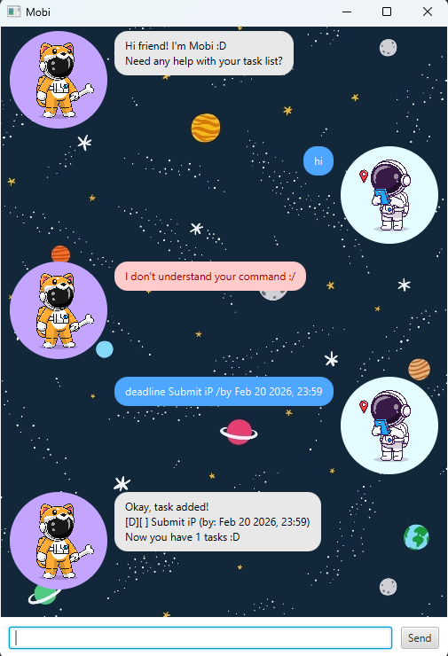

# Mobi User Guide

Mobi is a space-themed ChatBot that helps you efficiently manage your everyday tasks! It manages a task list 
for the user, performing actions based on user-input through the GUI chat interface.

## Quick Start

1. Ensure you have **Java 17** or above installed in your Computer.
2. Download the latest Mobi JAR file from [here](https://github.com/poise3/ip/releases).
3. Copy the file to the folder you want to use as the home folder for your Mobi ChatBot.
4. Open a command terminal, cd into the folder you put the jar file in, and use the java -jar mobi.jar command 
to run the application.
5. Type the command into the chat box and either press **Enter** or click **Send** to input command.
6. Refer to the command summary below and **Features** section for more details on each command.

## Command Summary
| Command      | Format                                     | Description                              |
|:-------------|:-------------------------------------------|:-----------------------------------------|
| **todo**     | `todo DESCRIPTION`                         | `Adds basic task`                        |
| **deadline** | `deadline DESCRIPTION /by DATE`            | `Adds task with deadline`                |
| **event**    | `event DESCRIPTION /from START /to END`    | `Adds task with start and end date`      |
| **list**     | `list`                                     | `Lists all tasks in the task list`       |
| **mark**     | `mark TASK_NUMBER`                         | `Marks task as complete`                 |
| **unmark**   | `unmark TASK_NUMBER`                       | `Marks task as incomplete`               |
| **delete**   | `delete TASK_NUMBER`                       | `Deletes task from task list`            |
| **sort**     | `sort CRITERIA`                            | `Sorts task list by criteria`            |
| **search**   | `search DATE`                              | `Lists all tasks that match date`        |
| **find**     | `find DESCRIPTION`                         | `Lists all tasks that match description` |
| **bye**      | `bye`                                      | `Exits the application`                  |

> [!NOTE]
> Dates can be specified in the following formats: \
> `yyyy-MM-dd`, `d/M/yyyy` or `MMM d yyyy`. \
> Exact time can be specified with `, HH:mm` or `, HHmm`.
## Features

### Adding a Todo task: todo

Adds a task to the task list. 

Format: `todo DESCRIPTION` \
Example: `todo Submit Assignment`

### Adding a Deadline task: deadline

Adds a deadline task to the task list.

Format: `deadline DESCRIPTION /by DATE` \
Example: `deadline Submit Assignment /by 2026-02-20, 2359`

### Adding a Event task: event

Adds an event task to the task list.

Format: `event DESCRIPTION /from DATE /to DATE` \
Example: `event Do Assignment /from 2026-02-18 /to 2026-02-20`

### Listing tasks : list

Shows all current tasks from the task list

Format: `list` 

### Marking/unmarking a task: mark/unmark

Marks/unmarks a task as complete/incomplete from the task list.

Format: `mark TASK_NUMBER`, `unmark TASK_NUMBER` \
Example: `mark 1`, `unmark 1`

### Deleting a task: delete

Deletes a task from the task list.

Format: `delete TASK_NUMBER` \
Example: `delete 1`

### Sorting the task list: sort

Sorts the tasks list based on task date, description, or type (todo, deadline, event).

Format: `sort CRITERIA` \
Example: `sort date`, `sort name`, `sort type`.

### Searching a task by date: search

Shows all tasks that match a given date.

Format: `search DATE` \
Example: `search 2026-02-20`

### Finding a task by description: find

Shows all tasks that fully or partially match a given description.

Format: `find DESCRIPTION` \
Example: `find Study`, `find Submit`

### Exiting the application: bye

Exits the application

Format: `bye` 

### Saving task data

Task list date is automatically saved to the hard disk after every command, into a TXT file. There is no need
to save automatically.